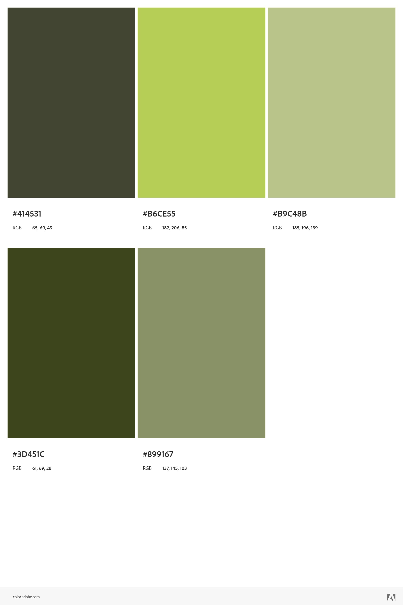
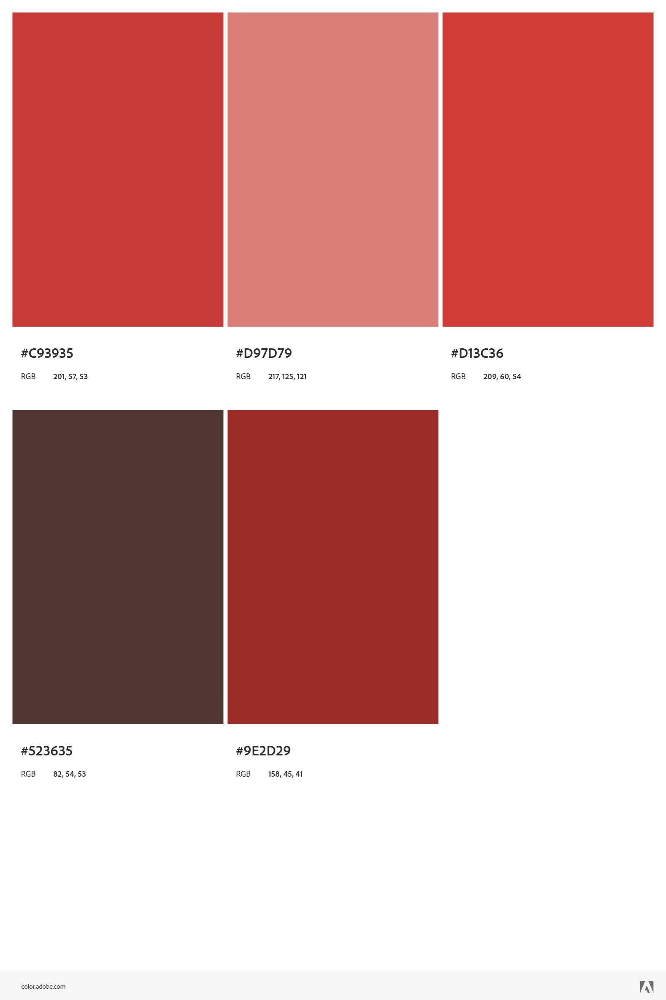
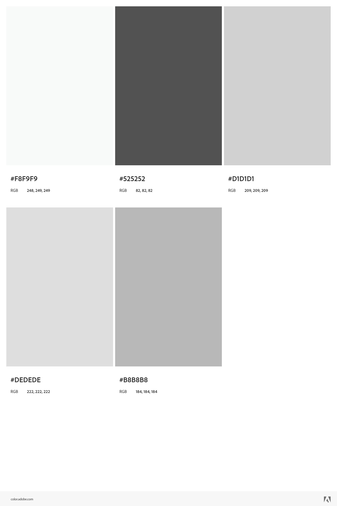
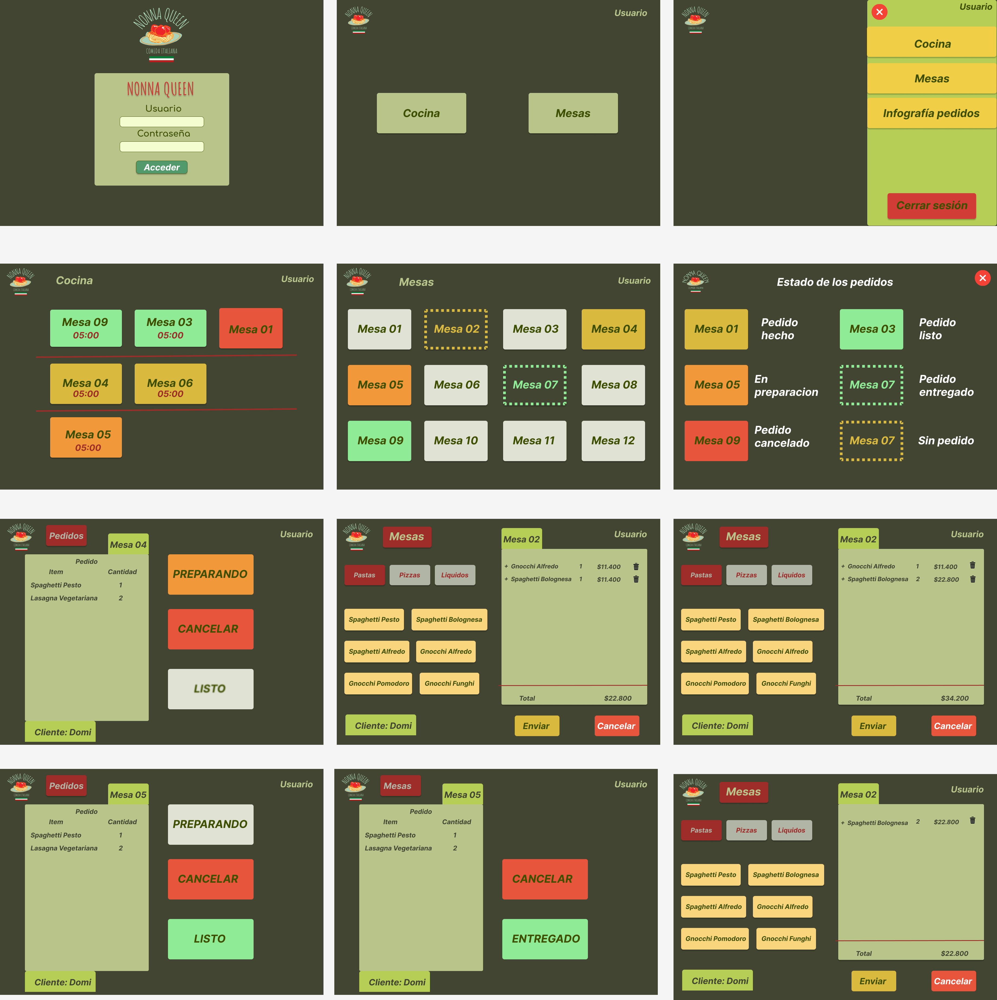

# Burger Queen

## DIAGRAMA DE FLUJO

## PALETA DE COLORES
#### Estados de pedido

#### Gamas app

## PROTOTIPO
Ver flujo [aquí](https://www.figma.com/file/zf6Iatfd72OyGpvaUfgDlk/NONNA-QUEEN?node-id=29%3A108)

## PROCEDIMIENTO
* Crear diagrama de flujo.
* Elegir tema y paleta de colores.
* Comenzar prototipo de alta.
* Instalar Tailwind css.
* Terminar prototipo.
* Instalar empaquetador Vite.
* Instalar dependencias de React Router Dom.